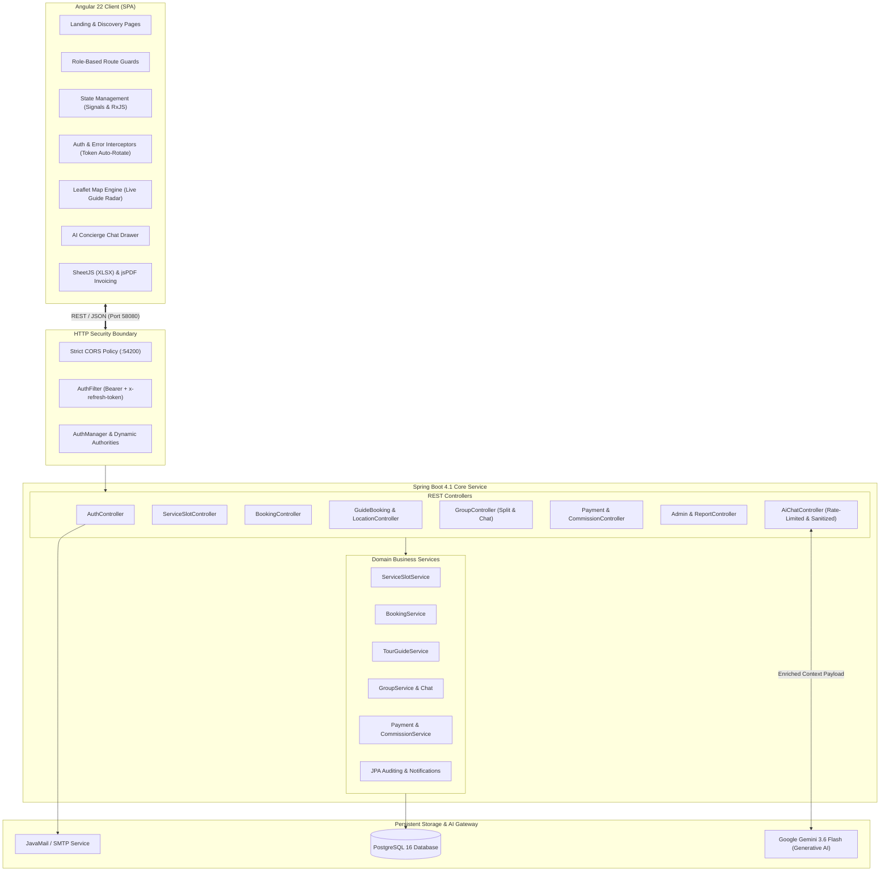
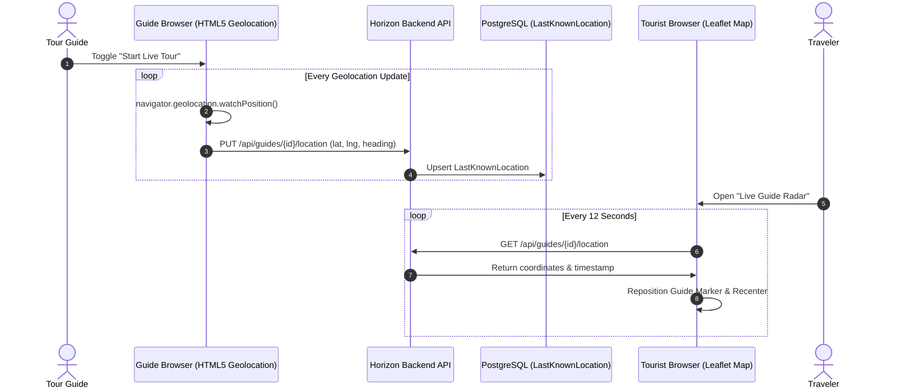
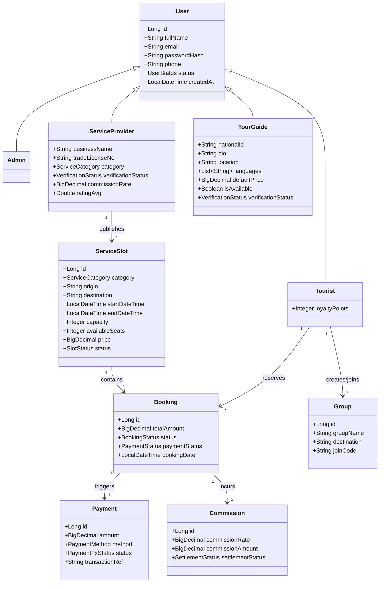

# 🌅 Horizon — All-in-One Travel & Tourism Booking System

[](https://openjdk.org/)
[](https://spring.io/projects/spring-boot)
[](https://spring.io/projects/spring-security)
[](https://angular.dev/)
[](https://www.typescriptlang.org/)
[](https://www.postgresql.org/)
[](https://ai.google.dev/)
[](https://leafletjs.com/)
[](https://playwright.dev/)

> **A full-stack, enterprise-grade travel marketplace and tourism management platform connecting Travelers, Transport/Hotel Service Providers, and Certified Tour Guides with real-time GIS tracking, group split-payments, automated commission settlements, and an intelligent, context-grounded AI Travel Concierge.**

---

## 📑 Table of Contents

- [Executive Overview](#-executive-overview)
- [System Architecture](#-system-architecture)
- [Key Features by User Persona](#-key-features-by-user-persona)
  - [🎒 Tourist Experience](#1--tourist-experience)
  - [🏢 Service Provider Portal](#2--service-provider-portal)
  - [🧭 Tour Guide Workspace](#3--tour-guide-workspace)
  - [🛡️ System Administrator Platform](#4--system-administrator-platform)
- [🤖 Horizon AI Concierge (Gemini Integration)](#-horizon-ai-concierge-gemini-integration)
- [🔐 Security & Authentication Engineering](#-security--authentication-engineering)
- [🗺️ GIS & Live Tour Guide Tracking](#️-gis--live-tour-guide-tracking)
- [📊 Financial Ledger, Commissions & Export Engine](#-financial-ledger-commissions--export-engine)
- [💻 Tech Stack & Engineering Tools](#-tech-stack--engineering-tools)
- [🗄️ Database Schema & Data Models](#️-database-schema--data-models)
- [🌐 RESTful API Endpoints](#-restful-api-endpoints)
- [🧪 Quality Assurance & Multi-Tier Testing](#-quality-assurance--multi-tier-testing)
- [🚀 Local Setup & Installation Guide](#-local-setup--installation-guide)
- [🎨 Design System & UI/UX Philosophy](#-design-system--uiux-philosophy)
- [🔮 Future Roadmap](#-future-roadmap)
- [👨‍💻 Author & Contact](#-author--contact)

---

## 🌟 Executive Overview

Modern travel planning is notoriously fragmented: travelers typically book transport across disparate ticketing portals, negotiate hotels separately, hire local guides via word-of-mouth, and manage group expenses using makeshift spreadsheets. 

**Horizon** resolves this fragmentation with a **unified travel marketplace and real-time tourism operating system**. Built using **Spring Boot 4 (Java 25)** on the backend and **Angular 22** on the frontend, Horizon integrates all phases of the travel lifecycle into a seamless digital journey:

```
[ Discovery & Search ] ➔ [ AI-Powered Recommendations ] ➔ [ Slot & Guide Booking ] 
       ➔ [ Group Split Settlement ] ➔ [ Real-Time GPS Tracking ] ➔ [ Verified Reviews & Ratings ]
```

### Why Horizon Stands Out to Recruiters and Engineering Teams:
1. **Bleeding-Edge Tech Stack:** Developed with **Java 25**, **Spring Boot 4.1**, **Spring Security 7**, and **Angular 22** using standalone components, modern signals, and reactive forms.
2. **Context-Grounded Generative AI:** The **AI Concierge** does not hallucinate arbitrary recommendations; it dynamically injects live database inventory (available transport slots, verified guides, and tourist travel groups) directly into **Google Gemini (gemini-3.6-flash)** and returns actionable system commands that drive frontend routing.
3. **Enterprise Zero-Trust Security:** Eliminates static shared JWT secrets by signing each user's token using their individual BCrypt password hash. Passwords updates instantly invalidate all outstanding tokens across all devices without needing distributed blacklists.
4. **Interactive GIS Integration:** High-precision HTML5 Geolocation tracking coupled with **Leaflet OpenStreetMap** renders live GPS beacons of tour guides on the tourist map interface.
5. **Multi-Tenant Financial Ecosystem:** Automated commission calculating engine, ledger accounting, and client-side PDF/Excel export engines for transparent financial settlements between vendors, guides, and the platform.

---

## 📐 System Architecture

Horizon follows a modern, decoupled client-server architecture with strict separation of concerns, secure REST interfaces, and stateless token lifecycle management.



---

## 🎯 Key Features by User Persona

Horizon is engineered from the ground up to support four distinct roles, each equipped with dedicated shells, workflows, and reactive dashboards:

### 1. 🎒 Tourist Experience
- **Faceted Multi-Modal Search:** Filter by travel category (`BUS`, `LAUNCH`, `TRAIN`, `HOTEL`, `RESORT`, `ATTRACTIONS`), origin, destination, travel dates, and price ceilings.
- **Cart & Direct Checkout:** Add single or bundled services to cart with immediate price breakdown and simulated payment checkout (Credit Card, bKash, Nagad, Bank Transfer).
- **Group Travel & Split Payments:**
  - Create travel parties and invite companions via unique **alphanumeric join codes**.
  - Attach platform bookings to the entire group.
  - Track individual member payment statuses (`PAID` vs `PENDING`) to manage group settlements.
  - Built-in internal group discussion thread.
- **Tour Guide Discovery & Booking:** Browse licensed regional guides, inspect spoke languages, experience level, verified credentials, and daily/hourly rates.
- **Live Guide Radar (GIS Tracking):** Real-time GPS location tracking on interactive Leaflet maps during active excursions.
- **Post-Trip Review System:** Submit independent ratings and textual feedback for transport providers and tour guides.
- **Instant Invoicing:** Generate and download official, branded PDF receipts with itemized tax and route details via `jsPDF`.

---

### 2. 🏢 Service Provider Portal
- **KYC & Business Registration:** Self-service registration specifying business category, trade license number (`TL-XXXX-XXXXX`), and official credentials.
- **Verification Workflow:** Dedicated verification gateway displaying approval, pending, or rejection states with administrator feedback.
- **Service Inventory Management:** Publish and schedule service slots, establish departures/arrivals, allocate seat capacities, and adjust pricing.
- **Booking Management Pipeline:** Monitor tourist reservations with real-time status transitions (`PENDING` ➔ `CONFIRMED` ➔ `COMPLETED` / `CANCELLED`).
- **Financial Ledger & Commissions:** Live visibility into gross sales revenue, platform commission withholdings, and net receivables.
- **Analytics & Report Export:** Export ledger statements, passenger manifests, and revenue spreadsheets directly to `.xlsx` (Excel) or `.pdf`.

---

### 3. 🧭 Tour Guide Workspace
- **Guide Accreditation:** Register national identity credentials (NID), regional coverage (e.g., Cox's Bazar, Sundarbans, Sreemangal), spoken languages, and bio.
- **Availability Calendar:** Publish open calendar dates with specific morning/afternoon schedules, pickup points, and custom itineraries.
- **Booking Requests Pipeline:** Accept or decline tour booking inquiries, confirm tour dates, and record cash/direct payments received.
- **Live GPS Broadcaster:** One-click location sharing using browser HTML5 Geolocation (`watchPosition`) transmitting precise coordinates to tourists.
- **Reputation Dashboard:** Review aggregated star ratings and traveler testimonials to maintain platform quality standards.

---

### 4. 🛡️ System Administrator Platform
- **Executive Operations Dashboard:** Real-time analytics tracking system-wide gross merchandise value (GMV), booking volume, and active user distribution.
- **KYC Approval Queue:** Review pending Service Provider and Tour Guide applications with one-click verification or rejection with audit reasons.
- **Role & Account Governance:** Inspect all user accounts across roles; activate, suspend, or permanently revoke delinquent profiles.
- **Automated Commission Management:** Audit platform commissions across all transactions with automatic margin calculations and settlement tracking.
- **Comprehensive Reporting Suite:** Date-bounded summaries for Revenue, Bookings, and Commission distributions with unified table exports.

---

## 🤖 Horizon AI Concierge (Gemini Integration)

The **Horizon AI Concierge** represents a breakthrough in practical, real-world LLM application for e-commerce:

```
[ Tourist User Message ] 
       │
       ▼
[ AiChatController ]
       │ 1. Rate Limiting (10 req/min per tourist)
       │ 2. Read live Slots, Guides, & Tourist Groups from DB Cache (30s TTL)
       │ 3. Build System Instruction + Grounded Context + Sanitized Input
       ▼
[ Google Gemini (gemini-3.6-flash) ]
       │ 4. Generates Wabi-Sabi response in strict JSON schema
       ▼
[ Server-Side Validation ]
       │ 5. Coerce unknown actionTypes to NONE
       │ 6. Verify recommended Slot ID / Guide ID exists in active DB catalog!
       ▼
[ Angular Client Action Dispatcher ]
       │ ➔ Auto-filters Browse View (/tourist/slots?destination=Sylhet&maxPrice=50)
       │ ➔ Auto-assembles Discounted Travel Bundles
```

### Safety & Grounding Highlights:
- **No Hallucinated Bookings:** The prompt specifically forbids inventing IDs. The backend validates any returned `slotId` or `guideId` against the active catalog before the JSON is passed to the browser.
- **Prompt Injection Defense:** Strict separation of system instructions and user inputs; tourist inputs are truncated to 1,000 characters and bounded to 12 chat history turns.
- **Zero API Key Leakage:** The Gemini API Key is maintained strictly within backend environment variables (`GEMINI_API_KEY`) and never transmitted to the frontend.
- **Conversational Tone:** Grounded in Horizon's calming, warm, and authentic "wabi-sabi" travel philosophy.

---

## 🔐 Security & Authentication Engineering

Horizon implements a zero-trust, stateless JWT security model tailored for high-concurrency environments:

| Feature | Implementation Detail | Benefit |
|---|---|---|
| **Per-User Secret Keying** | HMAC-SHA256 signature keyed with the user's individual BCrypt password hash. | Password changes instantly and unconditionally invalidate all outstanding sessions without requiring a database blacklist. |
| **Silent Refresh Header** | Frontend passes `x-refresh-token`. Backend validates and returns new access tokens in the `x-access-token` response header. | Continuous session continuity without user disruption or sudden redirect loops. |
| **Instant Global Revocation** | `users.tokens_valid_after` watermark updated on `POST /api/auth/logout-all`. | All tokens issued prior to that timestamp fail closed immediately. |
| **Strict Role Authorization** | Role-based authorities (`ADMIN`, `SERVICE_PROVIDER`, `TOUR_GUIDE`, `TOURIST`) evaluated via Spring Security 7. | Prevents role privilege escalation across domain endpoints. |
| **Self-Contained CORS** | Integrated directly into Spring Security FilterChain targeting `http://localhost:54200`. | Eliminates duplicate CORS headers while ensuring preflight safety. |

---

## 🗺️ GIS & Live Tour Guide Tracking

Horizon bridges the physical and digital travel experience with live geospatial tracking:



- **OpenStreetMap & Leaflet:** Fully open-source GIS stack without recurring Google Maps API license fees.
- **Dual Visual Markers:** Differentiates the traveler's GPS position from the guide's beacon with responsive status badges.

---

## 📊 Financial Ledger, Commissions & Export Engine

Financial accuracy is core to Horizon's multi-vendor marketplace:

- **Configurable Commission Rates:** Each Service Provider is configured with a percentage-based commission fee (e.g., 10% platform share).
- **Automated Settlement Pipeline:** Upon booking completion, platform commissions are recorded in the `commissions` table as `PENDING` until finalized by an administrator via `PUT /api/admin/commissions/{id}/settle`.
- **Client-Side Export Utility:**
  - **Excel Workbooks:** Using `xlsx` (SheetJS) to compile formatted multi-sheet financial ledgers with column summaries and totals.
  - **Branded Invoicing (PDF):** Powered by `jspdf` and `jspdf-autotable`, creating professional vector invoices including platform branding, itemized itineraries, tax calculations, and official disclaimers.

---

## 💻 Tech Stack & Engineering Tools

### 🌐 Frontend (HorizonFrontend)
- **Framework:** [Angular 22.0.0](https://angular.dev/) (Standalone Components, Signals, Reactive Forms, Typed Routing)
- **Language:** TypeScript 6.0.2
- **Styling & Icons:** Bootstrap 5.3.8, Bootstrap Icons 1.13.1, SCSS Modular Architecture
- **Mapping & GIS:** Leaflet 1.9.4 with `@types/leaflet`
- **Data Export & PDF:** SheetJS (xlsx 0.18.5), jsPDF 4.2.1, jsPDF-AutoTable 5.0.8
- **Unit Testing:** [Vitest 4.0.8](https://vitest.dev/) with JSDOM
- **Build System:** Angular CLI 22.0.5 (`@angular/build`)

### ⚙️ Backend (HorizonBackend)
- **Runtime & Framework:** Java 25, [Spring Boot 4.1.0 / 4.1.1](https://spring.io/projects/spring-boot)
- **Security:** Spring Security 7.0 (Stateless FilterChain, BCrypt Password Encryption)
- **Token Generation:** JJWT 0.13.0 (`jjwt-api`, `jjwt-impl`, `jjwt-gson`)
- **Persistence:** Spring Data JPA, Hibernate 6, PostgreSQL JDBC Driver
- **Generative AI:** Google Gemini API (`gemini-3.6-flash`) via Spring WebClient/RestClient
- **Utilities & Tooling:** Project Lombok, Apache Commons Lang 3, Google Gson, Jackson 3
- **Email:** Spring Boot Starter Mail (SMTP / Gmail App Passwords)
- **Testing:** JUnit 5, Mockito, Testcontainers (PostgreSQL 16), Playwright Black-box Suite

---

## 🗄️ Database Schema & Data Models

Horizon uses PostgreSQL with normalized entity relationships and inheritance:



---

## 🌐 RESTful API Endpoints

Horizon exposes an organized RESTful API surface partitioned by business domain:

| Domain | Method | Endpoint | Access Role | Description |
|---|---|---|---|---|
| **Auth** | `POST` | `/api/auth/login` | Public | Authenticates credentials; returns access & refresh tokens |
| **Auth** | `POST` | `/api/auth/register/tourist` | Public | Self-registration for tourists |
| **Auth** | `POST` | `/api/auth/register/provider` | Public | Submits business application for providers |
| **Auth** | `POST` | `/api/auth/register/guide` | Public | Submits tour guide application |
| **Auth** | `POST` | `/api/auth/logout-all` | Authenticated | Revokes all issued sessions across all devices |
| **Slots** | `GET` | `/api/slots/search` | Public | Multi-criteria search across available travel inventory |
| **Slots** | `POST` | `/api/slots` | `PROVIDER` | Publishes a new travel or accommodation slot |
| **Bookings**| `POST` | `/api/bookings` | `TOURIST` | Creates a travel slot booking reservation |
| **Bookings**| `PUT` | `/api/bookings/{id}/status` | Authenticated | Updates booking status (`CONFIRMED`, `COMPLETED`, etc.) |
| **Guides** | `GET` | `/api/guides` | Public | Lists available verified tour guides |
| **Guides** | `PUT` | `/api/guides/{id}/location`| `TOUR_GUIDE` | Broadcasts real-time latitude/longitude coordinates |
| **Guides** | `GET` | `/api/guides/{id}/location`| Authenticated | Reads live coordinates for radar tracking |
| **Groups** | `POST` | `/api/groups` | `TOURIST` | Creates a travel group and issues unique join code |
| **Groups** | `POST` | `/api/groups/join` | `TOURIST` | Joins a group using an alphanumeric join code |
| **Groups** | `POST` | `/api/groups/{id}/messages`| `TOURIST` | Dispatches group chat messages |
| **AI** | `POST` | `/api/ai/chat` | `TOURIST` | Invokes the Gemini AI Concierge with grounded context |
| **Payments**| `POST` | `/api/payments` | `TOURIST` | Initiates payment transaction record |
| **Admin** | `GET` | `/api/admin/pending-registrations` | `ADMIN` | Fetches unverified provider & guide applications |
| **Admin** | `PUT` | `/api/admin/providers/{id}/verify`| `ADMIN` | Approves or rejects provider credentials |
| **Admin** | `GET` | `/api/admin/reports/revenue-summary`| `ADMIN` | Aggregates period revenue & platform financials |

---

## 🧪 Quality Assurance & Multi-Tier Testing

Horizon employs a comprehensive testing pyramid ensuring reliability at every level:

```
          / \
         /   \       66 Black-Box Network API Tests (Playwright)
        /-----\      88 Integration Tests (Testcontainers + Real PostgreSQL 16)
       /       \     249 Fast Security & Service Unit Tests (JUnit 5 + Mockito)
      /---------\    Angular Component & Interceptor Tests (Vitest + JSDOM)
```

1. **Unit Tier (249 Tests):** Exercises core security logic, BCrypt hash verification, JWT expiry, lockout counter edge-cases, and prompt injection mitigation in milliseconds without database dependencies.
2. **Integration Tier (88 Tests):** Spawns a real, isolated PostgreSQL 16 instance via **Testcontainers** to validate database schemas, Spring Data JPA specifications, and actual HTTP round-trips.
3. **Black-Box API Tier (66 Playwright Tests):** Executes full end-to-end API test scripts against the packaged JAR over real networks without test hooks or Spring context access.
4. **Frontend Unit Tests:** Runs with the ultra-fast **Vitest** runner against modern Angular standalone components.

---

## 🚀 Local Setup & Installation Guide

### Prerequisites
- **Java Development Kit (JDK):** Version 25 installed and configured on your `PATH`.
- **Node.js & npm:** Node.js v20+ and npm v10+.
- **Database:** PostgreSQL 16+ running locally on port `5432`.
- **Build Tool:** Apache Maven 3.9+ (or use the included `./mvnw` wrapper).

---

### Step 1: Database Setup
Launch PostgreSQL and initialize the database:
```sql
CREATE DATABASE horizon;
```

---

### Step 2: Backend Configuration & Startup
1. Navigate to the backend service:
   ```bash
   cd HorizonBackend/demo
   ```
2. Verify or update `src/main/resources/application.properties` with your PostgreSQL credentials:
   ```properties
   spring.datasource.url=jdbc:postgresql://localhost:5432/horizon
   spring.datasource.username=postgres
   spring.datasource.password=your_postgres_password
   ```
3. *(Optional)* Provide your Google Gemini API key to enable the AI Concierge:
   ```bash
   # On Windows (PowerShell)
   $env:GEMINI_API_KEY="your-google-ai-studio-api-key"

   # On Linux / macOS
   export GEMINI_API_KEY="your-google-ai-studio-api-key"
   ```
4. Build and start the backend service:
   ```bash
   ./mvnw spring-boot:run
   ```
   *The backend will boot up and bind to:* `http://localhost:58080`

---

### Step 3: Frontend Configuration & Startup
1. In a new terminal window, navigate to the frontend directory:
   ```bash
   cd HorizonFrontend
   ```
2. Install npm dependencies:
   ```bash
   npm install
   ```
3. Start the Angular development server:
   ```bash
   npm start
   ```
4. Open your browser and navigate to:
   ```
   http://localhost:54200
   ```

---

### 🔑 Pre-Seeded Demo Credentials

The backend includes an automatic `DataSeeder` that seeds initial test accounts when started on a fresh database:

| Role | Email Address | Password | Description |
|---|---|---|---|
| 🛡️ **Administrator** | `admin@horizon.demo` | `demo1234` | Full access to approval queues, ledger, and reporting |
| 🏢 **Service Provider** | `provider@horizon.demo` | `demo1234` | Verified Bus operator ("Green Line Paribahan") |
| 🧭 **Tour Guide** | `guide@horizon.demo` | `demo1234` | Verified guide covering Cox's Bazar & Sundarbans |
| 🎒 **Tourist** | `tourist@horizon.demo` | `demo1234` | Traveler account with demo bookings and groups |

---

## 🎨 Design System & UI/UX Philosophy

Unlike conventional, corporate dashboards, Horizon incorporates an **Organic / Natural "Wabi-Sabi" Design Language**:
- **Philosophy:** Celebrates warmth, gentle curves, and natural connection over rigid digital coldness.
- **Color Palette:**
  - **Rice Paper (`#FDFCF8`):** Gentle, eye-friendly off-white background.
  - **Moss Green (`#5D7052`):** Primary brand accent symbolizing nature and trust.
  - **Terracotta / Clay (`#C18C5D`):** Secondary accent for warm highlights and action buttons.
  - **Deep Loam (`#2C2C24`):** High-contrast typography color avoiding pure harsh blacks.
- **Typography:** **Fraunces** serif typography for titles combined with rounded **Nunito** for legibility.
- **Micro-Interactions:** Smooth card hover lifts (`translateY`), soft diffused colored drop shadows, and pill-shaped interactive touch targets.

---

## 🔮 Future Roadmap

- [ ] **WebSocket STOMP Channel:** Real-time push notifications and sub-second guide GPS telemetry.
- [ ] **Native Mobile Application:** Cross-platform companion app for guides using Capacitor / Ionic.
- [ ] **Production Payment Gateways:** Direct integration with live SSLCommerz, Stripe, and bKash Merchant APIs.
- [ ] **Multi-Language Support (i18n):** Full internationalization supporting English and Bengali.
- [ ] **Docker Compose Pipeline:** Single-command containerized production deployment.

---

## 👨‍💻 Author & Contact

**Developed by Mohammad Ali Sikder Ramim**  
- **GitHub:** [@ali8012026masr](https://github.com/ali8012026masr)  
- **Project Repository:** [Horizon-All-in-one-Travel-Booking-Web-App](https://github.com/ali8012026masr/Horizon-All-in-one-Travel-Booking-Web-App)  

*If you found this project insightful or useful for your evaluation, feel free to star ⭐ the repository!*
